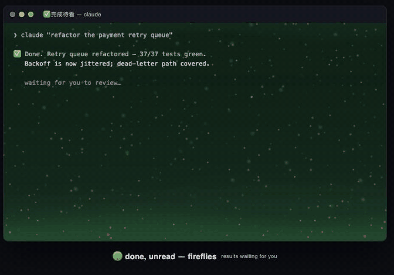

<div align="center">

# astra-glow

> *"一个字都不用读，终端先亮给你看。"*


**[English](README.md) · [中文](README_CN.md)**

<br>

**开着六个 agent 标签页——到底哪个在等人？**

**Agent 十分钟前就跑完了，人还在刷手机？**

**一小时前就翻车了，没有任何人知道？**

<br>

### AI coding agent 的环境状态灯。
### 跑着=极光，跑完=萤火虫，翻车=骷髅头。

<br>

[**快速开始**](#快速开始) · [**五态**](#五态) · [**原理**](#原理) · [**调参**](#调参)

<br>



<sub>*真 shader 实时渲染，五态连播。*</sub>

</div>

<br>

---

## 为什么有它

之前想知道某个 agent session 在干嘛：点进标签页、读 scrollback、判断它是还在跑、跑完了、还是卡在一个没人看见的授权确认上——每个标签页一遍，一小时重复无数遍。跑完的活儿躺着没人读，翻车的任务躺着没人发现。

有了 astra-glow，窗口本身就是状态栏。视线扫过一排标签页：极光流动=在干活，绿色萤火虫=有产出等着看，琥珀波浪=它在喊人，骷髅头=它没了。注意力该去哪，一眼定位。

## 五态

| 状态 | 触发 | 特效 |
|---|---|---|
| 🌀 **正在跑** | 发出 prompt | 暗色极光流彩 + 星尘 |
| 🟢 **完成待看** | agent 跑完本轮 | 翡翠呼吸 + 雾浪 + 上浮萤火虫 |
| 🟠 **等人** | 完成 10 分钟没人理 / agent 等授权 | 琥珀呼吸 + 层叠波浪 + 粒子 |
| 💀 **翻车** | 本轮报错 | 骷髅头（红瞳脉动）+ 余烬 + 暗角 |
| 👀 **已读** | 灯亮着时敲下任何一个键 | 静谧紫罗兰夜灯：慢呼吸 + 边缘微光 + 漂浮星尘 |

灯完成使命的瞬间自己安静下来：**在那个窗口敲下任何一个键**（回复、按 Esc 回主屏、甚至滚动）都算"已读"——靠 tty 的 access time 检测，零额外 hook——呼喊就软化成紫罗兰夜灯，静静陪着，直到下一条 prompt。agent 退出或 crash，watchdog 自动还原主题原色——绝不留残色。

## 支持的 agent

| Agent | 接法 | 状态 |
|---|---|---|
| **Claude Code** | `~/.claude/settings.json` hooks | 四态全 |
| **Codex CLI** | `~/.codex/hooks.json`（`UserPromptSubmit` / `Stop` / `PermissionRequest` / `PostToolUse`） | 四态全 |
| **其他任何 agent** | 生命周期事件里调 `glow.sh run\|done\|attn\|error\|resume\|end` | 四态全 |

## 快速开始

```bash
git clone https://github.com/Astralune-ai/astra-glow.git ~/Code/astra-glow
cd ~/Code/astra-glow
./install.sh          # ghostty + claude code + codex 全装; 幂等; 自动备份配置
```

重载 Ghostty（`cmd+shift+,`）或重启。agent 新开 session 自动点灯。

立刻看效果，任意终端标签页里：

```bash
bin/glow.sh demo 8    # 四态连播, 每态 8 秒
```

## 原理

两层解耦，**背景颜色本身就是两层之间的通信信道**——不要 socket、不要文件、不要 daemon：

1. **信号层**（`bin/glow.sh`）— agent hooks 调一个 shell 脚本，往本窗口 pty 写 OSC 11「信号色」。四种高饱和特定亮度的颜色，普通暗色主题永远撞不上。纯 shell，零 AI token，无轮询；唯一常驻进程是每个活跃窗口一个沉睡的 watchdog。
2. **特效层**（`shaders/astra-glow.glsl`）— Ghostty custom shader 从窗口四角采样背景色，按通道比例识别信号，只在背景像素上渲染对应的 60fps 特效。文字由色距蒙版保护。非信号色完全直通——没装 shader 也有四种静态色可辨。

tty 定位：沿 hook 进程的父链用 `lsof` 上溯，找到第一个 stdio 挂 `/dev/ttys*` 的祖先——它同时是 watchdog 盯的存活锚点。

## 调参

| 旋钮 | 方法 |
|---|---|
| 完成→琥珀催看延时 | `export GLOW_ATTN_SECS=300`（默认 `600`） |
| 特效密度 / 亮度 / 配色 | 改 `shaders/astra-glow.glsl`（单 `mainImage`，参数全内联），重载 Ghostty |
| 信号色 | `bin/glow.sh` 顶部 + shader 里对应阈值 |

## 踩坑实录（Ghostty shader 管线）

- Ghostty 的 GLSL→Metal 翻译链会**静默丢弃**编译不过的 shader，且 `glslang` 能过 ≠ Ghostty 能跑。shader 必须保守：单 `mainImage`、辅助函数极少、无分支 one-hot 状态权重。
- `custom-shader-animation = always` 必须设。默认值在窗口失焦时暂停动画——而状态灯恰恰是给没人盯着的窗口看的。
- 检测门要宽（毛玻璃、半透明会衰减采样值），分类用通道**比例**，亮度缩放动不了它。
- hook 进程通常没有 controlling tty，`/dev/tty` 是死路，走父链上溯。

## 依赖与终端兼容性

| 终端 | 信号色（五态） | GPU 特效（极光/萤火虫/骷髅头） |
|---|---|---|
| [Ghostty](https://ghostty.org) ≥ 1.2 | ✅ | ✅ 完整体验 |
| iTerm2 / Kitty / WezTerm / Alacritty | ✅（OSC 11 是通用协议） | — 优雅降级为四色状态灯 |

两层设计上就是解耦的：信号层只要终端支持 OSC 11，四色状态一眼可辨；动画层跑在 Ghostty 的 `custom-shader` 上，其他终端暂无等价物。

另需：`jq`、`lsof`（安装器 + 引擎）、macOS、任何有生命周期 hooks 的 agent。

**让 agent 代装也行**——对 Claude Code 或 Codex 说一句 *"帮我装 github.com/Astralune-ai/astra-glow"*，它照着本 README 就能装完。安装器幂等，动过的配置全部自动备份。

## License

Astra Source Available License. 个人使用和学习免费，商用需单独授权。详见 [LICENSE](LICENSE)。

---

<div align="center">

**别再挨个查岗了，让光替 agent 来报到。**


Powered by [**Astralune**](https://github.com/Astralune-ai)

</div>
